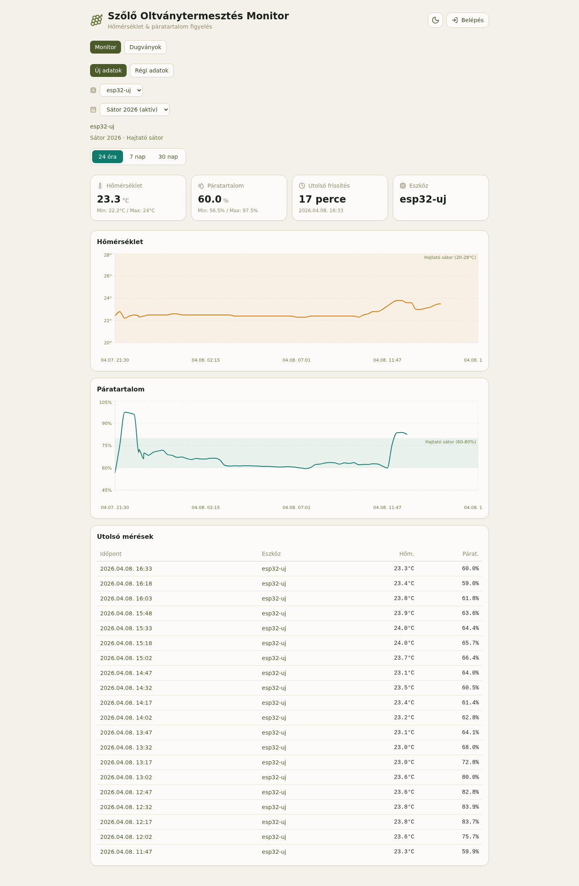
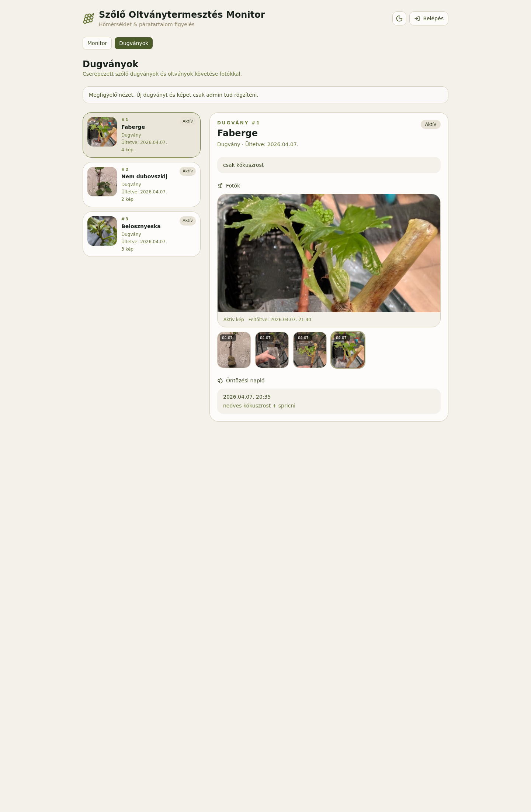

# ESP32 Temperature Logger

ESP32 + DHT22 alapú hőmérséklet- és páratartalom-logger projekt Firebase backendre és React dashboardra építve. A rendszer már nem csak egyetlen szenzort kezel: több eszköz, session-alapú monitorozás és egy külön szőlődugvány-követő nézet is része a dashboardnak.

## Dashboard preview




A rendszer fő részei:

- ESP32 firmware PlatformIO-val
- DHT22 / AM2302 szenzor
- Firebase Cloud Functions adatfogadáshoz
- Firestore adattárolás
- Firebase Storage a dugványfotókhoz
- React + Vite dashboard

## Mit tud most a rendszer

- hőmérséklet- és páratartalom-mérés DHT22 szenzorral
- Wi-Fi konfigurálás setup AP-n keresztül
- mért adatok feltöltése Firebase Cloud Functionre
- több szenzor kezelése `deviceId` alapján
- session alapú monitorozás külön szenzoronként
- session típusokhoz tartozó célzónák megjelenítése a grafikonokon
- régi és új adatstruktúra párhuzamos megjelenítése migrációs átmenethez
- külön dugványkövető oldal fotókkal és öntözési naplóval
- admin-only szerkesztés, képfeltöltés és naplózás

## Projektstruktúra

- `src/main.cpp`: ESP32 firmware
- `platformio.ini`: PlatformIO board / port / library config
- `platformio.local.ini`: lokális, gitből kizárt secret és endpoint config
- `functions/index.js`: Firebase HTTPS functionök
- `dashboard/`: React dashboard
- `docs/`: dokumentációs képek
- `tasks/`: task és terv fájlok
- `web/`: egyszerű statikus Firebase oldal

## Hardver

Használt elemek:

- ESP32 dev board
- DHT22 / AM2302 szenzor

Bekötés:

1. DHT22 `1. láb (VCC)` -> ESP32 `3V3`
2. DHT22 `2. láb (DATA)` -> ESP32 `GPIO27`
3. DHT22 `3. láb` -> nincs bekötve
4. DHT22 `4. láb (GND)` -> ESP32 `GND`
5. `4.7k`-`10k` pull-up ellenállás a `VCC` és `DATA` közé


Megjegyzés:

- A szenzort a rácsos oldalával magad felé nézve, lábakkal lefelé számold.
- A rossz jumper kábelek és rossz GND pont korábban valós hibaforrás voltak.

## Firmware működés

A jelenlegi firmware:

- WiFiManagerrel kezeli a Wi-Fi beállítást
- ha nincs mentett Wi-Fi vagy nem tud csatlakozni, setup AP-t nyit
- setup AP neve: `ESP32-DHT22-Setup`
- indulás után rögtön mér egyet
- utána `15 percenként` olvas és küld
- HTTPS `POST`-tal küldi az adatot Firebase Cloud Functionre
- a `deviceId` setup közben állítható és Preferences-ben mentődik

Fontos soros logok:

- `ESP32 + DHT22 indul.`
- `Wi-Fi kapcsolodva, IP: ...`
- `Setup AP elindult: ESP32-DHT22-Setup`
- `Homerseklet: ... C, Paratartalom: ... %`
- `HTTP status: 201`
- `Firebase kuldes sikeres.`

## PlatformIO használat

Build:

```bash
python3 -m platformio run
```

Feltöltés:

```bash
python3 -m platformio run --target upload
```

Soros monitor:

```bash
python3 -m platformio device monitor -b 115200
```

Ha az upload bootloader belépésen akad el, használd a board `BOOT/FLASH` + `RST` gombjait.

## Lokális config

A `platformio.local.ini` gitből ki van zárva.

Példa:

```ini
[env:esp32dev]
build_flags =
  -DFIREBASE_INGEST_URL=\"https://europe-west1-<firebase-project-id>.cloudfunctions.net/ingestReadingV2\"
  -DFIREBASE_DEVICE_TOKEN=\"dev-token\"
```

Mintafájl:

- `platformio.local.example.ini`

Megjegyzés:

- a `DEVICE_ID` már nem build flagből jön, hanem setup közben állítható és az ESP32 Preferences-ben menti el
- a `FIREBASE_DEVICE_TOKEN` továbbra is build-time secret marad

## Device token

A `FIREBASE_DEVICE_TOKEN` egy megosztott titok az ESP32 és a Cloud Function között.

Feladata:

- az ESP32 ezt küldi a `X-Device-Token` HTTP headerben
- a backend ezt ellenőrzi
- ha nem egyezik, a kérés `401 unauthorized` hibát kap

Fontos:

- ez nem a device azonosítója
- ez nem a session azonosítója
- ez nem felhasználónkénti token
- ez jelenleg egy közös eszköz-token, amit a firmware és a Firebase Functions ismer

Hol van beállítva:

- az ESP32 oldalon: `platformio.local.ini` `FIREBASE_DEVICE_TOKEN`
- a Firebase oldalon: `DEVICE_TOKEN` secret

Példa header:

```text
X-Device-Token: dev-token
```

## Wi-Fi konfiguráció

Első indításkor vagy ha nincs mentett hálózat:

1. Csatlakozz az `ESP32-DHT22-Setup` AP-hez
2. Nyisd meg a captive portált, vagy ezt:

```text
http://192.168.4.1
```

3. Add meg a helyi Wi-Fi SSID-t és jelszót
4. Add meg vagy módosítsd a `deviceId` értékét
5. A board elmenti és reset után automatikusan csatlakozik

## Firebase backend

Példa functionök:

- `ingestReading`
- `ingestReadingV2`

Régi endpoint:

- URL minta: `https://europe-west1-<firebase-project-id>.cloudfunctions.net/ingestReading`
- `POST` kérést fogad
- `X-Device-Token` headerrel autentikál
- a régi `sensorReadings` kollekcióba ír

Új endpoint:

- URL minta: `https://europe-west1-<firebase-project-id>.cloudfunctions.net/ingestReadingV2`
- `POST` kérést fogad
- `X-Device-Token` headerrel autentikál
- az új adatstruktúrába ír:
  - `devices/{deviceId}/readings`
- ismeretlen `deviceId` esetén automatikusan létrehozza a `devices/{deviceId}` dokumentumot
- az adott device aktív sessionjét keresi a `devices/{deviceId}/sessions` alatt
- a readinghez szerveroldali `createdAt` is mentődik, ez a dashboardban az elsődleges időforrás

Elvárt payload:

```json
{
  "deviceId": "esp32-lab",
  "temperatureC": 24.5,
  "humidity": 25.3
}
```

Kézi teszt a régi endpointtal:

```bash
curl -i -X POST 'https://europe-west1-<firebase-project-id>.cloudfunctions.net/ingestReading' \
  -H 'Content-Type: application/json' \
  -H 'X-Device-Token: dev-token' \
  -d '{"deviceId":"esp32-lab","temperatureC":24.5,"humidity":25.3}'
```

Kézi teszt az új endpointtal:

```bash
curl -i -X POST 'https://europe-west1-<firebase-project-id>.cloudfunctions.net/ingestReadingV2' \
  -H 'Content-Type: application/json' \
  -H 'X-Device-Token: dev-token' \
  -d '{"deviceId":"esp32-test","temperatureC":24.5,"humidity":25.3}'
```

Sikeres válasz:

```json
{"ok":true,"id":"..."}
```

## Firestore adatmodell

Jelenleg két adatfolyam él egymás mellett:

- legacy:
  - `sensorReadings`
  - `sessions`
- új struktúra:
  - `devices/{deviceId}`
  - `devices/{deviceId}/readings`
  - `devices/{deviceId}/sessions`
  - `sessionTypes/{sessionTypeId}`

A dashboardban az új struktúra az elsődleges, a legacy nézet pedig átmeneti kompatibilitási mód.

### Session típusok

A session típusok Firestore-ban vannak:

- `sessionTypes/callusing`
- `sessionTypes/hajtato-sator`

Egy `sessionTypes/{id}` dokumentum mezői:

- `name`
- `temperatureMin`
- `temperatureMax`
- `humidityMin`
- `humidityMax`

## Dugványkövetés

A dashboard külön nézetet kapott a cserepezett szőlő dugványok és oltványok nyomon követésére.

Fő útvonalak:

- `/`: monitor
- `/dugvanyok`: dugványlista
- `/dugvanyok/{cuttingId}`: egy konkrét dugvány részletes nézete

Fő képességek:

- lista és részletes nézet
- automatikus, cserépre írható sorszám
- fajta, típus, ültetési dátum és állapot nyilvántartása
- több kép feltöltése egy dugványhoz
- kliens oldali képátméretezés maximum `1000x1000` méretre
- mobilon külön `Kamera` és `Galéria` indítás
- öntözési napló rögzítése, szerkesztése és törlése
- admin-only írás, publikus olvasás

Firestore:

- `cuttings/{cuttingId}`

Egy dugvány dokumentum fő mezői:

- `serialNumber`
- `variety`
- `plantType`
- `plantedAt`
- `status`
- `notes`
- `photos`
- `wateringLogs`
- `createdAt`
- `updatedAt`
- `createdByUid`

A `photos` tömb elemei:

- `id`
- `storagePath`
- `downloadUrl`
- `capturedAt`
- `uploadedAt`
- `width`
- `height`
- `caption`

A `wateringLogs` tömb elemei:

- `id`
- `wateredAt`
- `notes`

Firebase Storage útvonal:

- `cuttings/{cuttingId}/photos/{photoId}.jpg`

## React dashboard

A dashboard a `dashboard/` mappában van.

Stack:

- React 19
- TypeScript
- Vite
- Firebase Web SDK
- Recharts
- Tailwind CSS

Fő nézetek:

- több szenzor közötti váltás
- session választás
- session kezelés admin módban
- hőmérséklet és páratartalom grafikon célzónákkal
- legutóbbi mérések táblázata
- dugványkezelő modul

Aktuális screenshotok:

- monitor nézet: [docs/dashboard-monitor.png](/home/pambruzs/projects/esp32/docs/dashboard-monitor.png)
- dugvány nézet: [docs/dashboard-cuttings.png](/home/pambruzs/projects/esp32/docs/dashboard-cuttings.png)

Indítás:

```bash
cd dashboard
npm install
npm run dev
```

Build:

```bash
cd dashboard
npm run build
```

A dashboard Firebase configja:

- `dashboard/src/lib/firebase.ts`

Ezt a saját Firebase projektedhez kell igazítani.

## Firebase deploy

Projekt kiválasztás:

```bash
firebase use <firebase-project-id>
```

Secret beállítás:

```bash
printf 'dev-token' | firebase functions:secrets:set DEVICE_TOKEN
```

Meglévő secret ellenőrzése:

```bash
firebase functions:secrets:access DEVICE_TOKEN
```

Functions + rules deploy:

```bash
firebase deploy --only functions,firestore:rules,firestore:indexes,storage
```

Hosting deploy:

```bash
firebase deploy --only hosting
```

Megjegyzés:

- a function Gen2 (`europe-west1`)
- az első deploy új projektnél lassú lehet, mert több Google API és Cloud Build/Run erőforrás jön létre
- ha új endpointot vezetsz be, az ESP32 `FIREBASE_INGEST_URL` értékét is frissíteni kell a megfelelő function URL-re
- a dugványfotók miatt a Storage rules deploy is a projekt része lett

## Egyszerű statikus webes nézet

A `web/` mappában van egy egyszerűbb, nem React alapú Firebase oldal is:

- `web/index.html`
- `web/app.js`
- `web/firebase-config.js`

## Git

A repo inicializálva van.

Első commit:

- `7b5125d` - `Initial project setup`

Ignore-olt lokális fájlok:

- `.pio/`
- `platformio.local.ini`
- `functions/node_modules/`
- Firebase debug logok

## Jelenlegi állapot

A projekt jelenleg képes:

- DHT22 adat olvasásra
- Wi-Fi setup AP indításra
- mentett Wi-Fi használatára
- Firebase HTTPS function hívására
- Firestore-ba logolásra
- több szenzor kezelésére
- session alapú monitorozásra
- szerveridő-alapú frissítés kijelzésre
- React dashboardon történő megjelenítésre
- szőlő dugványok fotós és öntözési naplós követésére

Ha valami nem működik, első körben ezt érdemes ellenőrizni:

1. a DHT bekötés és a pull-up ellenállás rendben van-e
2. a jó soros port van-e használva
3. a `platformio.local.ini` a jó endpointot és tokent tartalmazza-e
4. a function tényleg `201`-et ad-e `curl`-lel
5. a Firestore és Storage rules deployolva vannak-e
