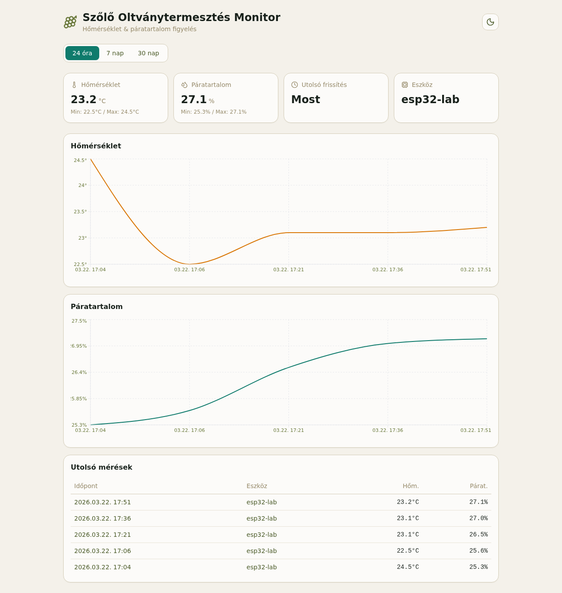

# ESP32 Temperature Logger

ESP32 + DHT22 alapú hőmérséklet- és páratartalom-logger projekt, amely a mért adatokat nemcsak elküldi Firebase-be, hanem webes dashboardon meg is jeleníti.

## Dashboard preview



A rendszer részei:

- ESP32 firmware PlatformIO-val
- DHT22 / AM2302 szenzor
- Firebase Cloud Function adatfogadáshoz
- Firestore adattárolás
- React + Vite dashboard a mért adatok megjelenítésére

## Mit tud a rendszer

- hőmérséklet- és páratartalom-mérés DHT22 szenzorral
- Wi-Fi konfigurálás setup AP-n keresztül
- mért adatok feltöltése Firebase Cloud Functionre
- adatok tárolása Firestore-ban
- adatok megjelenítése React dashboardon grafikonokkal és táblázatban

## Projektstruktúra

- `src/main.cpp`: ESP32 firmware
- `platformio.ini`: PlatformIO board / port / library config
- `platformio.local.ini`: lokális, gitből kizárt secret és endpoint config
- `functions/index.js`: Firebase HTTPS function
- `dashboard/`: React dashboard
- `web/`: egyszerű statikus Firebase oldal

## Hardver

Használt elemek:

- ESP32 dev board
- DHT22 / AM2302 szenzor

Bekötés:

1. DHT22 `1. láb (VCC)` -> ESP32 `3V3`
2. DHT22 `2. láb (DATA)` -> ESP32 `GPIO27`
3. DHT22 `3. láb` -> nincs bekötve
4. DHT22 `4. láb (GND)` -> ESP32 `GND`
5. `4.7k`-`10k` pull-up ellenállás a `VCC` és `DATA` közé


Megjegyzés:

- A szenzort a rácsos oldalával magad felé nézve, lábakkal lefelé számold.
- A rossz jumper kábelek és rossz GND pont korábban valós hibaforrás voltak.

## Firmware működés

A jelenlegi firmware:

- WiFiManagerrel kezeli a Wi-Fi beállítást
- ha nincs mentett Wi-Fi vagy nem tud csatlakozni, setup AP-t nyit
- setup AP neve: `ESP32-DHT22-Setup`
- indulás után rögtön mér egyet
- utána `15 percenként` olvas és küld
- HTTPS `POST`-tal küldi az adatot Firebase Cloud Functionre

Fontos soros logok:

- `ESP32 + DHT22 indul.`
- `Wi-Fi kapcsolodva, IP: ...`
- `Setup AP elindult: ESP32-DHT22-Setup`
- `Homerseklet: ... C, Paratartalom: ... %`
- `HTTP status: 201`
- `Firebase kuldes sikeres.`

## PlatformIO használat

Build:

```bash
python3 -m platformio run
```

Feltöltés:

```bash
python3 -m platformio run --target upload
```

Soros monitor:

```bash
python3 -m platformio device monitor -b 115200
```

Ha az upload bootloader belépésen akad el, használd a board `BOOT/FLASH` + `RST` gombjait.

## Lokális config

A `platformio.local.ini` gitből ki van zárva.

Példa:

```ini
[env:esp32dev]
build_flags =
  -DFIREBASE_INGEST_URL=\"https://europe-west1-g-temp-log.cloudfunctions.net/ingestReading\"
  -DFIREBASE_DEVICE_TOKEN=\"dev-token\"
  -DDEVICE_ID=\"esp32-lab\"
```

Mintafájl:

- `platformio.local.example.ini`

## Wi-Fi konfiguráció

Első indításkor vagy ha nincs mentett hálózat:

1. Csatlakozz az `ESP32-DHT22-Setup` AP-hez
2. Nyisd meg a captive portált, vagy ezt:

```text
http://192.168.4.1
```

3. Add meg a helyi Wi-Fi SSID-t és jelszót
4. A board elmenti és reset után automatikusan csatlakozik

## Firebase backend

Aktív projekt:

- `g-temp-log`

Aktív function:

- `ingestReading`
- URL: `https://europe-west1-g-temp-log.cloudfunctions.net/ingestReading`

A function:

- `POST` kérést fogad
- `X-Device-Token` headerrel autentikál
- Firestore `sensorReadings` kollekcióba ír

Elvárt payload:

```json
{
  "deviceId": "esp32-lab",
  "temperatureC": 24.5,
  "humidity": 25.3
}
```

Kézi teszt:

```bash
curl -i -X POST 'https://europe-west1-g-temp-log.cloudfunctions.net/ingestReading' \
  -H 'Content-Type: application/json' \
  -H 'X-Device-Token: dev-token' \
  -d '{"deviceId":"esp32-lab","temperatureC":24.5,"humidity":25.3}'
```

Sikeres válasz:

```json
{"ok":true,"id":"..."}
```

## Firebase deploy

Projekt kiválasztás:

```bash
firebase use g-temp-log
```

Secret beállítás:

```bash
printf 'dev-token' | firebase functions:secrets:set DEVICE_TOKEN
```

Functions deploy:

```bash
firebase deploy --only functions
```

Megjegyzés:

- a function Gen2 (`europe-west1`)
- az első deploy új projektnél lassú lehet, mert több Google API és Cloud Build/Run erőforrás jön létre

## React dashboard

A dashboard a `dashboard/` mappában van.

Stack:

- React 19
- TypeScript
- Vite
- Firebase Web SDK
- Recharts
- Tailwind CSS

Indítás:

```bash
cd dashboard
npm install
npm run dev
```

Build:

```bash
cd dashboard
npm run build
```

A dashboard Firebase configja:

- `dashboard/src/lib/firebase.ts`

Ez jelenleg a `g-temp-log` Firestore projektet használja.

## Egyszerű statikus webes nézet

A `web/` mappában van egy egyszerűbb, nem React alapú Firebase oldal is:

- `web/index.html`
- `web/app.js`
- `web/firebase-config.js`

## Git

A repo inicializálva van.

Első commit:

- `7b5125d` - `Initial project setup`

Ignore-olt lokális fájlok:

- `.pio/`
- `platformio.local.ini`
- `functions/node_modules/`
- Firebase debug logok

## Jelenlegi állapot

A projekt jelenleg képes:

- DHT22 adat olvasásra
- Wi-Fi setup AP indításra
- mentett Wi-Fi használatára
- Firebase HTTPS function hívására
- Firestore-ba logolásra
- React dashboardon történő megjelenítésre
- időbeli trendek megjelenítésére webes felületen

Ha valami nem működik, első körben ezt érdemes ellenőrizni:

1. a DHT bekötés és a pull-up ellenállás rendben van-e
2. a jó soros port van-e használva
3. a `platformio.local.ini` a jó endpointot és tokent tartalmazza-e
4. a function tényleg `201`-et ad-e `curl`-lel
